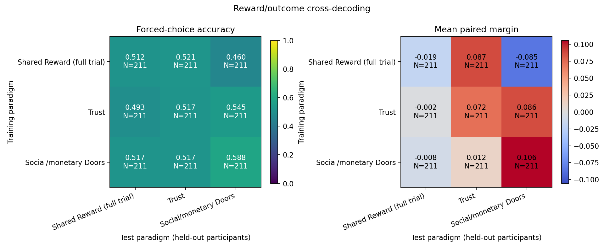
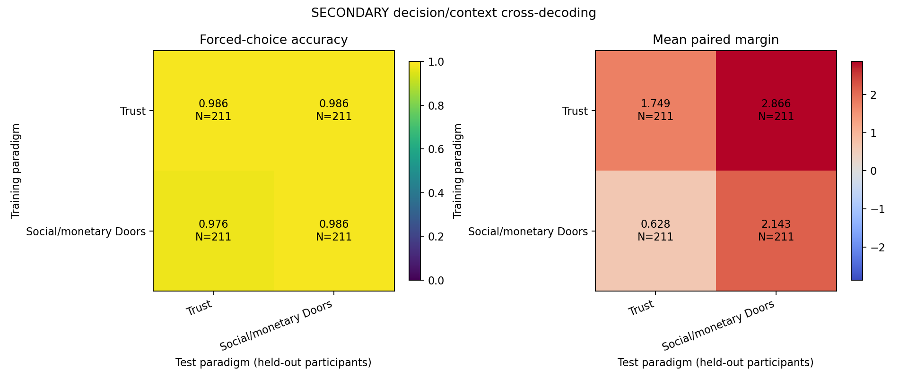
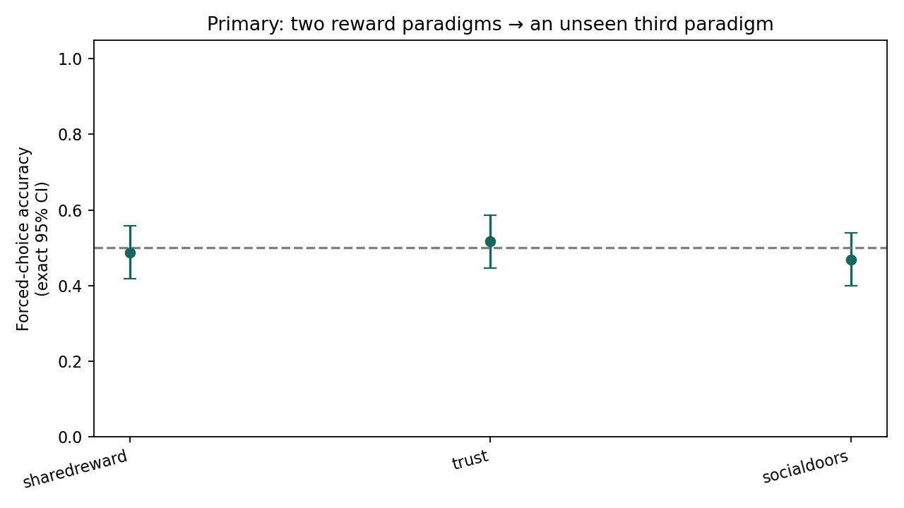
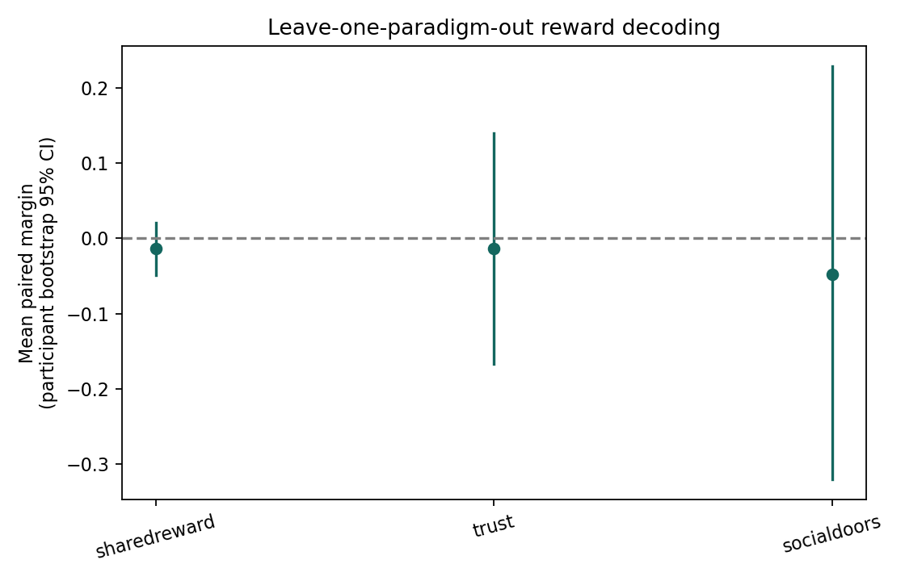
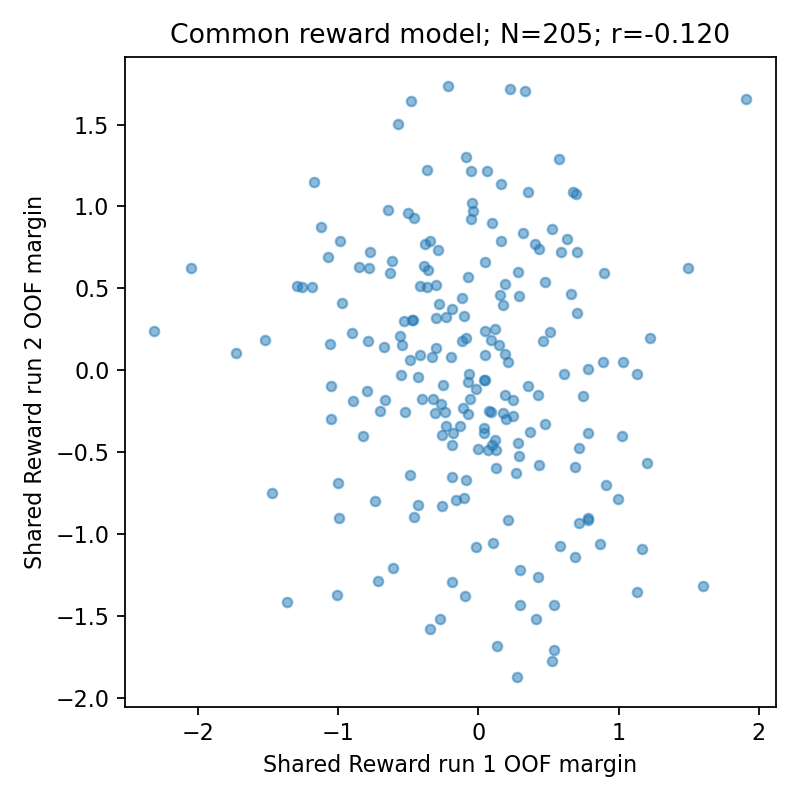
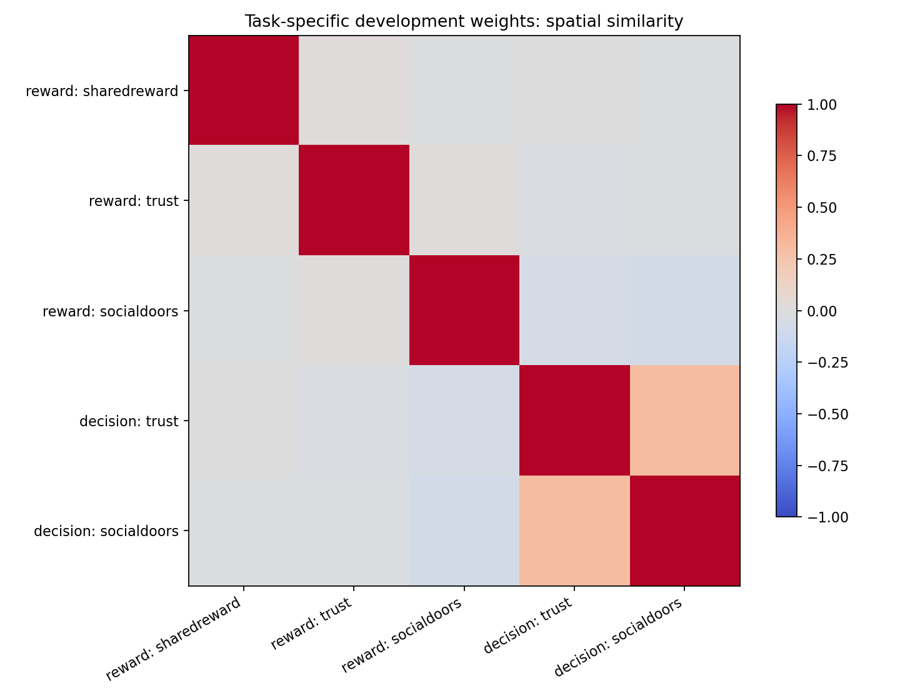
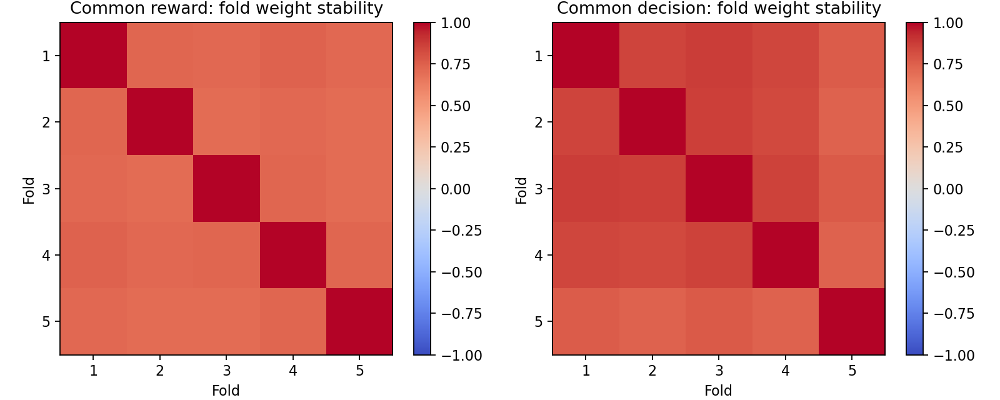
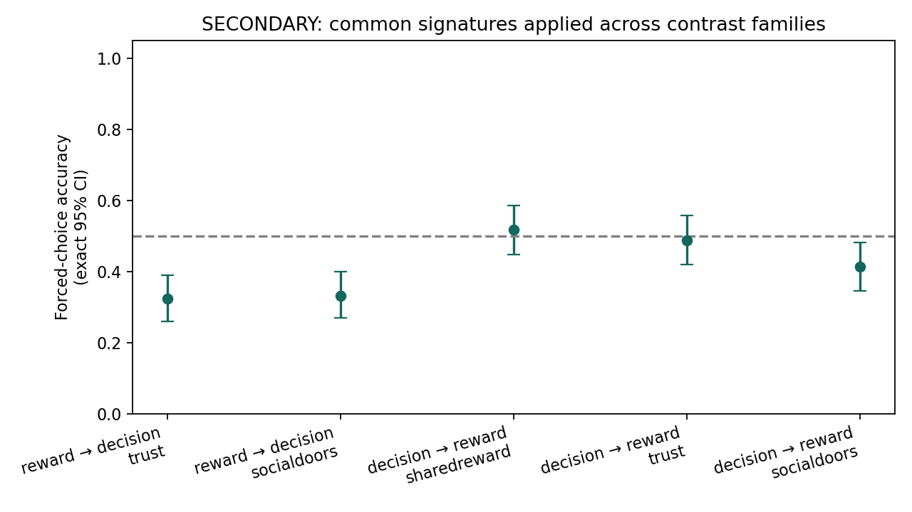

# RF1-SRA trans-task social-reward pilot

| repository | head_sha | status |
| --- | --- | --- |
| rf1-sra-neural-signature | bfd928abe70cf03590598efedf3d3954827a8556 | clean |
| rf1-sra-linux2 | 302dccf4ed04619bb94a557c3ec39c7a8f09cb1e | clean |
| rf1-sra-sharedreward | d716f84412902671b82adfa2a22c265c09c2de01 | dirty |
| rf1-sra-trust | bc731ddd143eea8737f42c22e7e334f5a9dc5532 | clean |
| rf1-sra-socdoors | e77700ddf09a2fe9ab7e6ce9b32bc298082d419e | clean |
| rf1-sra-ugr | 0a6715565b065e13ff03368700df952b2180fb13 | clean |
| sharedreward-aging | 6ffef27d417c46484925fe068e70c3289c1a9d73 | clean |

Multitask-complete development N=211; internal multitask holdout N=50. Minimum cohort N=250; split: age_5_quantiles_x_flipangle.

## A–B. Within-task and pairwise reward decoding

| train_tasks | test_task | n | accuracy | ci_low | ci_high | mean_margin | margin_ci_low | margin_ci_high | binomial_p |
| --- | --- | --- | --- | --- | --- | --- | --- | --- | --- |
| sharedreward | sharedreward | 211 | 0.5118 | 0.4423 | 0.5811 | -0.01884 | -0.09377 | 0.05658 | 0.7831 |
| sharedreward | trust | 211 | 0.5213 | 0.4517 | 0.5904 | 0.08713 | -0.09085 | 0.2577 | 0.5819 |
| sharedreward | socialdoors | 211 | 0.4597 | 0.3911 | 0.5295 | -0.085 | -0.3984 | 0.234 | 0.2706 |
| trust | sharedreward | 211 | 0.4929 | 0.4236 | 0.5624 | -0.002371 | -0.0367 | 0.033 | 0.8905 |
| trust | trust | 211 | 0.5166 | 0.447 | 0.5857 | 0.07216 | -0.005689 | 0.1538 | 0.6797 |
| trust | socialdoors | 211 | 0.545 | 0.4752 | 0.6135 | 0.08621 | -0.05048 | 0.2243 | 0.2152 |
| socialdoors | sharedreward | 211 | 0.5166 | 0.447 | 0.5857 | -0.008242 | -0.02691 | 0.01041 | 0.6797 |
| socialdoors | trust | 211 | 0.5166 | 0.447 | 0.5857 | 0.01236 | -0.03588 | 0.06084 | 0.6797 |
| socialdoors | socialdoors | 211 | 0.5877 | 0.518 | 0.6548 | 0.1056 | 0.02214 | 0.1879 | 0.01301 |

## C. Primary leave-one-paradigm-out reward tests

| train_tasks | test_task | n | accuracy | ci_low | ci_high | mean_margin | margin_ci_low | margin_ci_high | binomial_p |
| --- | --- | --- | --- | --- | --- | --- | --- | --- | --- |
| trust+socialdoors | sharedreward | 211 | 0.4882 | 0.4189 | 0.5577 | -0.01392 | -0.0487 | 0.02086 | 0.7831 |
| sharedreward+socialdoors | trust | 211 | 0.5166 | 0.447 | 0.5857 | -0.01342 | -0.1675 | 0.1398 | 0.6797 |
| sharedreward+trust | socialdoors | 211 | 0.4692 | 0.4003 | 0.5389 | -0.04801 | -0.3204 | 0.2293 | 0.4088 |

## D. Task-specific and common weight similarity

| model_a | model_b | r |
| --- | --- | --- |
| reward_task-sharedreward | reward_task-trust | 0.01229 |
| reward_task-sharedreward | reward_task-socialdoors | -0.01427 |
| reward_task-socialdoors | reward_task-trust | 0.01236 |
| common_reward_signature | reward_task-sharedreward | 0.8137 |
| common_reward_signature | reward_task-trust | 0.3513 |
| common_reward_signature | reward_task-socialdoors | 0.2329 |
| common_reward_signature | decision_task-trust | -0.0132 |
| common_reward_signature | decision_task-socialdoors | -0.02492 |
| decision_task-trust | reward_task-sharedreward | -0.001555 |
| decision_task-trust | reward_task-trust | -0.02555 |
| decision_task-trust | reward_task-socialdoors | -0.05976 |
| decision_task-socialdoors | reward_task-sharedreward | -0.01016 |
| decision_task-socialdoors | reward_task-trust | -0.02056 |
| decision_task-socialdoors | reward_task-socialdoors | -0.07086 |
| decision_task-socialdoors | decision_task-trust | 0.3014 |
| common_decision_signature | reward_task-sharedreward | -0.003981 |
| common_decision_signature | reward_task-trust | -0.02732 |
| common_decision_signature | reward_task-socialdoors | -0.05976 |
| common_decision_signature | common_reward_signature | -0.01839 |
| common_decision_signature | decision_task-trust | 0.9375 |
| common_decision_signature | decision_task-socialdoors | 0.4831 |

## Analysis availability

| analysis | status | reason |
| --- | --- | --- |
| sharedreward_decision | unavailable | Full-trial model has no isolated decision estimates |
| sharedreward_neutral | unavailable | Neutral maps are outside the verified upstream candidate set |
| sharedreward_run_reliability | paired_runs_only | 205 development participants with two retained verified runs; no imputation |

## E. Common signature probes: UGR and Trust decompositions

| train_family | train_tasks | test_task | n | accuracy | ci_low | ci_high | mean_margin | margin_ci_low | margin_ci_high | binomial_p |
| --- | --- | --- | --- | --- | --- | --- | --- | --- | --- | --- |
| reward | sharedreward+trust+socialdoors | ugr_pmod | 211 | 0.5735 | 0.5037 | 0.6411 | 0.008195 | -0.007275 | 0.02353 | 0.03864 |
| reward | sharedreward+trust+socialdoors | ugr_constant | 211 | 0.4028 | 0.3361 | 0.4724 | -0.065 | -0.09864 | -0.03216 | 0.005763 |
| reward | sharedreward+trust+socialdoors | friend_computer | 211 | 0.5261 | 0.4564 | 0.595 | 0.04183 | -0.1182 | 0.205 | 0.4913 |
| reward | sharedreward+trust+socialdoors | stranger_computer | 211 | 0.455 | 0.3865 | 0.5248 | 0.003961 | -0.1658 | 0.1741 | 0.2152 |
| reward | sharedreward+trust+socialdoors | friend_stranger | 211 | 0.5498 | 0.48 | 0.6181 | 0.03787 | -0.1224 | 0.1983 | 0.1684 |
| decision | trust+socialdoors | ugr_pmod | 211 | 0.4455 | 0.3773 | 0.5153 | -0.003667 | -0.02111 | 0.01396 | 0.1297 |
| decision | trust+socialdoors | ugr_constant | 211 | 0.9905 | 0.9662 | 0.9989 | 0.8419 | 0.7809 | 0.9053 | 1.359e-59 |

Strong UGR offer-modulation transfer would be consistent with broader social-value information. Weak UGR transfer alongside successful reward cross-decoding would be consistent with greater reward/outcome specificity, subject to measurement and power limitations. Neither result changes the model.

## F. Secondary decision/context and cross-family decoding

| train_tasks | test_task | n | accuracy | ci_low | ci_high | mean_margin | margin_ci_low | margin_ci_high | binomial_p |
| --- | --- | --- | --- | --- | --- | --- | --- | --- | --- |
| trust | trust | 211 | 0.9858 | 0.959 | 0.9971 | 1.749 | 1.619 | 1.879 | 9.516e-58 |
| trust | socialdoors | 211 | 0.9858 | 0.959 | 0.9971 | 2.866 | 2.698 | 3.039 | 9.516e-58 |
| socialdoors | trust | 211 | 0.9763 | 0.9456 | 0.9923 | 0.628 | 0.5816 | 0.6739 | 2.069e-54 |
| socialdoors | socialdoors | 211 | 0.9858 | 0.959 | 0.9971 | 2.143 | 2.038 | 2.249 | 9.516e-58 |

| train_family | test_family | train_tasks | test_task | n | accuracy | ci_low | ci_high | mean_margin | margin_ci_low | margin_ci_high | binomial_p |
| --- | --- | --- | --- | --- | --- | --- | --- | --- | --- | --- | --- |
| reward | decision | sharedreward+trust+socialdoors | trust | 211 | 0.3223 | 0.2598 | 0.3899 | -0.2878 | -0.3735 | -0.2025 | 2.647e-07 |
| reward | decision | sharedreward+trust+socialdoors | socialdoors | 211 | 0.3318 | 0.2686 | 0.3997 | -0.452 | -0.5983 | -0.3081 | 1.156e-06 |
| decision | reward | trust+socialdoors | sharedreward | 211 | 0.5166 | 0.447 | 0.5857 | -0.00523 | -0.07649 | 0.06607 | 0.6797 |
| decision | reward | trust+socialdoors | trust | 211 | 0.4882 | 0.4189 | 0.5577 | -0.05434 | -0.2022 | 0.09795 | 0.7831 |
| decision | reward | trust+socialdoors | socialdoors | 211 | 0.4123 | 0.3452 | 0.482 | -0.414 | -0.638 | -0.1933 | 0.01301 |

Reward/context similarity and bidirectional cross-application describe common versus distinct information; they do not by themselves establish a selective reward mechanism.

## Reliability and stability

| n | pearson_r | spearman_rho | icc_3_1 | run1_accuracy | run2_accuracy | development_n | single_run_not_scored_n |
| --- | --- | --- | --- | --- | --- | --- | --- |
| 205 | -0.1202 | -0.148 | -0.1186 | 0.4683 | 0.4976 | 211 | 6 |

| model | mean_off_diagonal | min_off_diagonal | max_off_diagonal |
| --- | --- | --- | --- |
| reward_task-sharedreward | 0.7334 | 0.7156 | 0.7546 |
| reward_task-trust | 0.7351 | 0.6997 | 0.7651 |
| reward_task-socialdoors | 0.7333 | 0.7017 | 0.7607 |
| reward_lopo-sharedreward | 0.7239 | 0.6918 | 0.7562 |
| reward_lopo-trust | 0.7238 | 0.7072 | 0.7448 |
| reward_lopo-socialdoors | 0.723 | 0.7016 | 0.7507 |
| common_reward_signature | 0.7151 | 0.6977 | 0.7403 |
| decision_task-trust | 0.8151 | 0.7472 | 0.8687 |
| decision_task-socialdoors | 0.8459 | 0.7748 | 0.9081 |
| common_decision_signature | 0.813 | 0.7376 | 0.8723 |

## Warnings

- Shared Reward uses verified RF1 full-trial activation from sharedreward-aging: decision onset through outcome offset. Reward-condition differences are not isolated outcome-epoch estimates.
- The secondary decision matrix and common decision signature use Trust and Doors only. Shared Reward decision-phase and unverified neutral probes are unavailable, not null results.
- Single-run Shared Reward participants use the verified retained L1 directly for primary analyses. Reliability uses only the two-retained-run development subset.
- Exactly N=50 internal multitask holdout participants were never voxel-loaded or scored.
- Every test participant is absent from that model’s training data in every paradigm and family.
- LOPO omits the test reward paradigm entirely. Pooled within-task CV tests unseen participants, not unseen paradigms.
- Decision/context analyses remain secondary pending construct review. UGR is broader social valuation/decision context, not an isolated decision epoch or a fourth reward training task.
- No model settings, masks, or contrast definitions are changed in response to decoding performance.
- Shared Reward has 6-mm total smoothness; Trust and Doors use 5-mm FEAT smoothing. Cross-task differences can affect generalization.
- One fixed development-only mask is used without labels; CV inference is conditional on that mask.
- Binomial p values are two-sided and unadjusted. Ties count as incorrect. Intervals do not capture all dependence induced by overlapping CV training sets.
- Weight similarity is descriptive and affected by shared participants and correlated voxels. Similarity or failed cross-decoding alone does not establish psychological identity or dissociation.
- Mask: TemplateFlow_MNI152NLin6Asym_intersect_95pct_development_multitask_FEAT; resampled statistical image loads: 0.

Contrast formulas: `docs/ANALYSIS_PLAN.md`. Key outputs: `results/aggregate/`, `results/maps/common_reward_signature_DEV_weights.nii.gz`, `results/maps/common_decision_signature_DEV_weights.nii.gz`, `results/figures/`, `provenance/model.json`.

## Exact cohort intersections

| tasks | n |
| --- | --- |
| sharedreward | 346 |
| trust | 292 |
| socialdoors | 336 |
| doors | 336 |
| ugr | 316 |
| sharedreward+trust | 288 |
| sharedreward+socialdoors | 332 |
| sharedreward+doors | 333 |
| sharedreward+ugr | 312 |
| trust+socialdoors | 280 |
| trust+doors | 281 |
| trust+ugr | 271 |
| socialdoors+doors | 334 |
| socialdoors+ugr | 306 |
| doors+ugr | 307 |
| sharedreward+trust+socialdoors | 277 |
| sharedreward+trust+doors | 278 |
| sharedreward+trust+ugr | 268 |
| sharedreward+socialdoors+doors | 331 |
| sharedreward+socialdoors+ugr | 303 |
| sharedreward+doors+ugr | 304 |
| trust+socialdoors+doors | 279 |
| trust+socialdoors+ugr | 265 |
| trust+doors+ugr | 266 |
| socialdoors+doors+ugr | 305 |
| sharedreward+trust+socialdoors+doors | 276 |
| sharedreward+trust+socialdoors+ugr | 262 |
| sharedreward+trust+doors+ugr | 263 |
| sharedreward+socialdoors+doors+ugr | 302 |
| trust+socialdoors+doors+ugr | 264 |
| sharedreward+trust+socialdoors+doors+ugr | 261 |

## Sample description

| split | variable | category | value |
| --- | --- | --- | --- |
| development | n |  | 211 |
| development | age_n |  | 211 |
| development | age_missing |  | 0 |
| development | age_mean |  | 46.12 |
| development | age_sd |  | 18.02 |
| development | age_min |  | 20 |
| development | age_q25 |  | 28 |
| development | age_median |  | 46 |
| development | age_q75 |  | 62 |
| development | age_max |  | 89 |
| development | flipangle_counts | 50 | 188 |
| development | flipangle_counts | 20 | 23 |
| development | sex_counts | F | 113 |
| development | sex_counts | M | 93 |
| development | sex_counts | O | 5 |
| holdout | n |  | 50 |
| holdout | age_n |  | 50 |
| holdout | age_missing |  | 0 |
| holdout | age_mean |  | 47.2 |
| holdout | age_sd |  | 18.64 |
| holdout | age_min |  | 21 |
| holdout | age_q25 |  | 28.25 |
| holdout | age_median |  | 52.5 |
| holdout | age_q75 |  | 62 |
| holdout | age_max |  | 83 |
| holdout | flipangle_counts | 50 | 44 |
| holdout | flipangle_counts | 20 | 6 |
| holdout | sex_counts | F | 32 |
| holdout | sex_counts | M | 18 |

