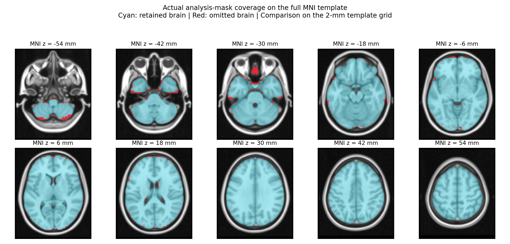

# Review before revising the social reward/context/closeness analysis

This reviews the completed v3 run at `55857ec`. It does not apply exclusions,
change the locked split, refit models, or evaluate holdout images. Decision-phase
models and UGR are outside the proposed next analysis. The v3 launcher remains a
record of the completed analysis, not the command for a revised analysis.

## Actual common-mask coverage

The saved mask contains 83,731 voxels at approximately 2.70 x 2.70 x 2.97 mm.
The comparison template has the exact SHA-256 recorded in the completed run.

| Comparison | Retained |
| --- | ---: |
| Template brain resampled onto the native analysis grid | 99.11% (83,731 / 84,479 voxels) |
| Full 2-mm template brain; analysis mask resampled with nearest neighbor | 97.56% |
| Historical combined cerebellum/brainstem region on the 2-mm template grid | 95.09% |
| Remaining template brain on the 2-mm grid | 97.87% |
| Full-template brain outside the analysis image field of view | 0.00% |

The two whole-brain percentages use different grids and reflect boundary
sampling as well as mask exclusions. They are not contradictory. Visual review
shows broad whole-brain coverage, including cerebellum/brainstem, without gross
field-of-view truncation. These mask checks do not establish adequate local
signal, absence of susceptibility dropout, or good tSNR inside every retained voxel.
A poor-signal region can remain inside a binary FEAT mask.



Cyan is retained template brain; red is omitted template brain. The overlay is
on the full public MNI template, not on a participant image. It reads only the
already-published aggregate analysis mask and public reference images.

## Historical imaging-QC rules and likely attrition

The exact source revision used by the completed run is linux2
`302dccf4ed04619bb94a557c3ec39c7a8f09cb1e`. Its `qc/qc_policy.json` uses one pass,
linear quartiles, and 1.5 x IQR fences separately by paradigm. Social Doors and
monetary Doors are pooled only when deriving their QC fences. Existing thresholds
are used; they are not recalculated on whichever subset survives another metric.

| Metric | Historical poor-quality rule | Shared Reward fence | Trust fence | Doors pooled fence |
| --- | --- | ---: | ---: | ---: |
| MRIQC echo-2 tSNR | below Q1 - 1.5 IQR | <1.4370 | <0.3376 | <6.8633 |
| MRIQC echo-2 mean FD | above Q3 + 1.5 IQR | >0.4231 | >0.4284 | >0.3851 |
| Brain coverage (%) | below Q1 - 1.5 IQR | <99.1518 | <99.1657 | <99.0754 |
| TEDANA rejected components | above Q3 + 1.5 IQR | >39 | >40.375 | >36.5 |

The first three metrics match the user's named priorities. Show their effect
alongside the full prior four-metric policy rather than silently treating the
combined `imaging_qc_outlier` field as a three-metric rule.

Historical coverage QC uses a target that **removes cerebellum/brainstem**. The
current analysis mask includes those regions; good historical coverage QC alone
therefore does not establish their signal quality.

The following are background counts across all canonical baseline QC records,
not the locked N=261 cohort, and not restricted to aging-retained runs. Counts
cannot be summed across tasks or metrics to infer final exclusions.

| Task | Participants with QC rows | Any tSNR/coverage/FD flag | Any of all four flags |
| --- | ---: | ---: | ---: |
| Shared Reward | 348 | 47 | 77 |
| Trust | 344 | 50 | 85 |
| Social Doors | 337 | 33 | 50 |
| Monetary Doors | 337 | 38 | 55 |

The three-metric counts here are driven by FD/coverage: no Shared Reward or Trust
baseline runs cross the historical low-tSNR fence. This says what that prior rule
does; it is not evidence that all remaining data have adequate tSNR.

Exact development/holdout attrition requires the private inventory and locked
membership on Linux2. Run from this analysis repository after pulling main:

```bash
"${PYTHON:-python3}" code/review_qc_attrition.py
```

This writes aggregate `results/aggregate/qc_review_retention.tsv`,
`results/aggregate/qc_review_overlap.tsv`, and `provenance/qc_review.json`.
It reads metadata tables only. It reports the existing development and holdout
partitions separately; no excluded participant is replaced or reassigned.
Candidates outside the locked cohort are descriptive only.

For this conservative review, a task fails when any run contributing to its
existing map fails a selected QC metric. Missing selected QC evidence is unknown,
not a pass. Shared Reward checks only the frozen retained runs; Trust checks both
runs contributing to its current L2. An L2 containing a bad run cannot become a
clean one-run map merely by filtering a downstream table. Run-level salvage with
newly combined maps would be a separate analysis revision.

Removing UGR from the scientific question also removes the rationale for making
UGR completeness mandatory in a new analysis. The review shows Shared Reward +
Trust and those tasks plus both Doors implementations. Its input-availability
flags still come from the original inventory, including that inventory's contrast
requirements, so newly eligible counts need a fresh reward-only inventory before
being used. Do not redraw the old holdout or move exposed development participants
into it. The old N>=250 / exactly 50 policy may need explicit revision after the
QC attrition table is reviewed; the review does not weaken that gate automatically.

## Proposed scientific organization

Preserve the six condition maps per task: friend, stranger, and computer under
positive and negative outcomes. Shared Reward uses full-trial `F_rew`, `S_rew`,
`C_rew`, `F_pun`, `S_pun`, `C_pun` (COPEs 4,6,2,3,5,1). Trust uses outcome-phase
`F_rec`, `S_rec`, `C_rec`, `F_def`, `S_def`, `C_def` (COPEs 7,9,5,6,8,4).
The following use arithmetic on those verified maps; no new FEAT jobs are implied.

Let R_F = F_rew - F_pun, R_S = S_rew - S_pun, and R_C = C_rew - C_pun.
For Trust, replace `rew/pun` with `rec/def`. Let M_F, M_S, M_C be the respective
averages of positive- and negative-outcome maps.

| Question | Maps / contrasts | Proposed prediction or comparison |
| --- | --- | --- |
| Partner identity in reward sensitivity | R_F, R_S, R_C kept separate | Three-class friend/stranger/computer prediction, with a confusion matrix; 1/3 chance for balanced classes. |
| Social modulation of reward sensitivity | (R_F + R_S)/2 versus R_C | Human versus computer reward-difference patterns, preserving separate F/S results rather than relying solely on pooling. |
| Social context averaged over outcome valence | (M_F + M_S)/2 versus M_C | Human versus computer context from equal-weight outcome averages. This is a context contrast, not a decision-phase model. |
| Closeness during positive outcomes | SR F_rew[4] versus S_rew[6]; Trust F_rec[7] versus S_rec[9] | Friend versus stranger, Shared Reward -> Trust and Trust -> Shared Reward. |
| Closeness during negative outcomes | SR F_pun[3] versus S_pun[5]; Trust F_def[6] versus S_def[8] | Friend versus stranger under punishment/defection, in both transfer directions. |
| Closeness modulation of reward sensitivity | R_F versus R_S; difference = (F_positive - F_negative) - (S_positive - S_negative) | Friend versus stranger reward-difference patterns, in both transfer directions. |

A general valence positive control would train positive versus negative outcome
maps with partners balanced; it answers reward/outcome discrimination, not partner
identity. It should be named separately from the social reward tests.

For a classifier, use the F and S maps as its two labeled examples; `F-S` describes
the contrast being assessed. A single signed F-S map per participant is not by
itself a two-class dataset. For every transfer test, exclude the test participant
from training across all tasks, runs, and conditions. Keep existing participant
fold membership where possible, documenting any changes required after exclusions.

The three closeness contrasts are related: reward-minus-punishment is built from
the other two. They need a declared primary comparison and multiplicity control.
Model choice or contrast selection informed by the completed v3 results is
exploratory development; independent holdout validation comes after freezing the
revised analysis. Faces/familiarity, agency, other stimulus features, and the
full-trial versus outcome timing mismatch remain construct limits. Doors can
support social-versus-monetary reward/context transfer, but has no matching
friend/stranger manipulation for a closeness test.

## Reusing computer conditions and leakage

A computer condition reused in two comparisons creates statistical dependence;
it is not automatically train/test leakage. Avoid duplicating C as independent
training observations in a three-class dataset: use F, S, C once each per person.
Keep every representation of one participant in the same fold across both tasks.
Do not add the F-C and S-C samples as if they doubled the number of independent
participants. In a linear contrast, `(F-C) - (S-C) = F-S`; the computer cancels.
Closeness can be tested directly with F/S, without a computer comparator.

Shared C does not make separately reported comparisons independent, and a shared
noise term can inflate their apparent similarity. Balanced contrast coefficient
vectors for sociality and closeness are orthogonal, but that alone does not imply
independent noisy GLM estimates. Choose all masks/features/tuning using training
or independent data, never the test participants or desired performance result.

Method references: [grouped cross-validation](https://scikit-learn.org/stable/modules/cross_validation.html)
and [Kriegeskorte et al., circular analysis](https://pmc.ncbi.nlm.nih.gov/articles/PMC2841687/).

## Review validation and reproduction

Three focused QC-review tests passed. They cover retained versus unretained runs,
three- versus four-metric policies, overlapping failures, missing QC, duplicate
keys, source/split immutability, aggregate-only output, and a failing image loader
that proves the QC review does not access images. The mask overlay was visually
inspected; template, aggregate-mask, and historical regional-mask hashes were checked.
No production analysis settings or completed results were changed.

Public templates were downloaded from the TemplateFlow S3 dataset:
`tpl-MNI152NLin6Asym/tpl-MNI152NLin6Asym_res-02_desc-brain_mask.nii.gz` and
`tpl-MNI152NLin6Asym/tpl-MNI152NLin6Asym_res-02_T1w.nii.gz`.
The first exactly matches the completed run's template hash. With those saved as
`template_brain_mask.nii.gz` and `template_T1w.nii.gz` in a local reference directory:

```bash
python3 code/review_mask_coverage.py --reference-dir /path/to/reference \
  --regional-mask /path/to/rf1-sra-linux2/qc/reference/source-cerebellum-brainstem_mask.nii.gz
```

The background `source_qc_summary.json` counts rows from the pinned source commit's
`qc/run_qc.tsv`, filtered to baseline and each named task; it reports unique
participant counts under any of the corresponding metric flags. Its source TSV
SHA-256 is recorded so those counts can be reproduced without any neural data.
